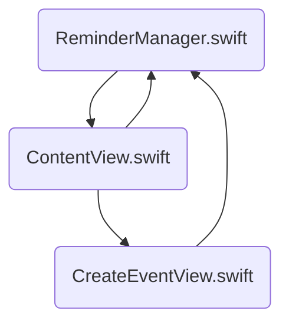

# EventKitとは
https://developer.apple.com/documentation/eventkit
一つ
SwiftUIでは、EventKitフレームワークを使用することで、Apple純正のカレンダー・リマインダーのデータを取得・変更することができます。
[EventKit UI](https://developer.apple.com/documentation/eventkitui)を使用することでイベントの表示・作成などのインタフェースを簡単にアプリに組み込むこともできます。(この記事では紹介しないです。)
今回は、EventKitを使用して、リマインダーのタスクの取得・作成・変更・削除を行います。
１つ 

## カレンダー編はこちらの記事で紹介しています。
https://zenn.dev/ryo_dev/articles/afc9b7686e08c5

# 今回作成するファイル
今回作成するアプリでは、
リマインダーを操作(タスクの取得・作成・変更・削除)するReminderManager.swiftと、
取得したイベントを表示するContentView.swiftと、
イベントの追加・変更をするCreateEventView.swiftを作成します。



# リマインダーにアクセスする手順
## 1. Info.plisにKeyとValueの追加
https://developer.apple.com/documentation/bundleresources/information_property_list/nsremindersusagedescription

Key
```swift
Privacy - Reminders Usage Description
```
Valueには下記のような利用用途を記載します。
```swift
リマインダーは、タスクの表示に使用されます。
```

## 2. リマインダーを操作するClassを作成
```swift:ReminderManager.swift
import Foundation

class ReminderManager: ObservableObject {
    
}
```

## 3. EventKitをインポート
```swift:ReminderManager.swift
import EventKit
```

## 4. リマインダーへのアクセスを要求
```swift:ReminderManager.swift
var store = EKEventStore()
// リマインダーへの認証ステータスのメッセージ
@Published var statusMessage = ""

init() {
    Task {
        do {
            // リマインダーへのアクセスを要求
            try await store.requestAccess(to: .reminder)
        } catch {
            print(error.localizedDescription)
        }
        // リマインダーへの認証ステータス
        let status = EKEventStore.authorizationStatus(for: .reminder)
        
        switch status {
        case .notDetermined:
            statusMessage = "リマインダーへのアクセスする\n権限が選択されていません。"
        case .restricted:
            statusMessage = "リマインダーへのアクセスする\n権限がありません。"
        case .denied:
            statusMessage = "リマインダーへのアクセスが\n明示的に拒否されています。"
        case .authorized:
            statusMessage = "リマインダーへのアクセスが\n許可されています。"
        @unknown default:
            statusMessage = "@unknown default"
        }
    }
}
```

## 5. ContentViewでReminderManagerを使用する
今回は、一つのReminderManagerのインスタンスを複数のViewで使用したいため、@EnvironmentObjectを使用しています。

ContentViewを変更します。
```swift:ContentView.swift
struct ContentView: View {
    @EnvironmentObject var reminderManager: ReminderManager
    
    var body: some View {
        VStack {
            Text(reminderManager.statusMessage)
        }
    }
}
```

```diff swift:EventKit_ReminderApp.swift
 @main
 struct EventKit_ReminderApp: App {
     var body: some Scene {
         WindowGroup {
             ContentView()
+                .environmentObject(ReminderManager())
         }
     }
 }
```

## 6. 完成🎉


:::details ここまでのコード
```swift:ContentView.swift
import SwiftUI

struct ContentView: View {
    @EnvironmentObject var reminderManager: ReminderManager
    
    var body: some View {
        VStack {
            Text(reminderManager.statusMessage)
        }
    }
}
```

```swift:ReminderManager.swift
import Foundation
import EventKit

class ReminderManager: ObservableObject {
    var store = EKEventStore()
    // リマインダーへの認証ステータスのメッセージ
    @Published var statusMessage = ""
    
    init() {
        Task {
            do {
                // リマインダーへのアクセスを要求
                try await store.requestAccess(to: .reminder)
            } catch {
                print(error.localizedDescription)
            }
            // リマインダーへの認証ステータス
            let status = EKEventStore.authorizationStatus(for: .reminder)
            
            switch status {
            case .notDetermined:
                statusMessage = "リマインダーへのアクセスする\n権限が選択されていません。"
            case .restricted:
                statusMessage = "リマインダーへのアクセスする\n権限がありません。"
            case .denied:
                statusMessage = "リマインダーへのアクセスが\n明示的に拒否されています。"
            case .authorized:
                statusMessage = "リマインダーへのアクセスが\n許可されています。"
            @unknown default:
                statusMessage = "@unknown default"
            }
        }
    }
}
```

```swift:EventKit_ReminderApp.swift
import SwiftUI

@main
struct EventKit_ReminderApp: App {
    var body: some Scene {
        WindowGroup {
            ContentView()
                .environmentObject(ReminderManager())
        }
    }
}
```
:::

# リマインダーを表示する手順
## 1. リマインダーを取得する関数を作成
https://developer.apple.com/documentation/eventkit/retrieving_events_and_reminders

受け取った日付から、期間内の未完了のリマインダーを取得して、配列に追加する関数を作成します。
:::message alert
predicateForIncompleteRemindersメソッドで指定する期間は、
withDueDateStarting < 取得する範囲 ≦ ending
であることに注意してください。[^1]
今回の例では、前日の23:59:59 ~ 23:59:0を指定することで、
0:00 ~ 23:59までのイベントを取得しています。
イベントのデータベースは秒数のデータは持っていないため、
withDueDateStartingは取得したい範囲-1秒することで期待通りの動きをします。
[^1]: 2022年12月16日現在
Xcode14.2およびiOS16.2で検証
:::

```swift:ReminderManager.swift
// 取得されたリマインダー
@Published var reminders: [EKReminder]? = nil
// 取得したいリマインダーの日付
@Published var day = Date()

/// リマインダーの取得
func fetchReminder() {
    // 開始日コンポーネントの作成
    // 指定した前の日付の23:59:59
    let start = Calendar.current.date(byAdding: .second, value: -1, to: Calendar.current.startOfDay(for: day))
    // 終了日コンポーネントの作成
    // 指定した日付の23:59:0
    let end = Calendar.current.date(bySettingHour: 23, minute: 59, second: 0, of: Calendar.current.startOfDay(for: day))
    // イベントストアのインスタンスメソッドから述語を作成
    var predicate: NSPredicate? = nil
    predicate = store.predicateForIncompleteReminders(withDueDateStarting: start, ending: end, calendars: nil)
    // 述語に一致する全てのリマインダーを取得
    if let predicate {
        store.fetchReminders(matching: predicate) { reminder in
            self.reminders = reminder
        }
    }
}
```
### predicateForIncompleteReminders(withDueDateStarting:ending:calendars:)
https://developer.apple.com/documentation/eventkit/ekeventstore/1507143-predicateforincompletereminders

- withDueDateStarting
	指定した日時を含まない、取得するリマインダーの始まりの範囲
withDueDateStartingに日付を指定してendingにnilを指定した場合はendingより前のイベントを取得する。(その際、日時の指定をしていないリマインダーは取得されない)
- ending
	指定した日時を含む、取得するリマインダーの終わりの範囲
withDueDateStartingに日付を指定してendingにnilを指定した場合はwithDueDateStartingより後のイベントを取得する。(その際、日時の指定をしていないリマインダーは取得されない)
- calendars
	リマインダーを取得するカレンダーの指定
全てのカレンダーを取得したい場合は、nilにする。

## 2. fetchEvent()を呼び出す
カレンダーへのアクセスが許可されていた場合は、先ほど作成したfetchEvent()を呼び出します。

```diff swift:ReminderManager.swift
 init() {
     Task {
         do {
             // リマインダーへのアクセスを要求
             try await store.requestAccess(to: .reminder)
         } catch {
             print(error.localizedDescription)
         }
         // リマインダーへの認証ステータス
         let status = EKEventStore.authorizationStatus(for: .reminder)
         
         switch status {
         case .notDetermined:
             statusMessage = "リマインダーへのアクセスする\n権限が選択されていません。"
         case .restricted:
             statusMessage = "リマインダーへのアクセスする\n権限がありません。"
         case .denied:
             statusMessage = "リマインダーへのアクセスが\n明示的に拒否されています。"
         case .authorized:
             statusMessage = "リマインダーへのアクセスが\n許可されています。"
+            fetchReminder()
         @unknown default:
             statusMessage = "@unknown default"
         }
     }
 }
```

## 3. イベントを表示
ContentViewを下記のように変更します。
ReminderManagerの配列にイベントが入っている場合は、イベントの一覧を表示、
ReminderManagerの配列にイベントが入っていない場合は、認証ステータスが表示されます。

```diff swift:ContentView.swift
struct ContentView: View {
    @EnvironmentObject var reminderManager: ReminderManager
    
    var body: some View {
        if let aReminder = reminderManager.reminders {
            NavigationStack {
                List(aReminder, id: \.calendarItemIdentifier) { reminder in
                    HStack {
                        Image(systemName: reminder.isCompleted ? "checkmark.circle.fill" : "circle")
                            .foregroundColor(reminder.isCompleted ? Color.accentColor : Color.gray)
                        Text(reminder.title)
                    }
                }
                .toolbar {
                    ToolbarItem(placement: .principal) {
                        DatePicker("", selection: $reminderManager.day, displayedComponents: .date)
                            .labelsHidden()
                            .onChange(of: reminderManager.day) { newValue in
                                reminderManager.fetchReminder()
                            }
                    }
                }
            }
        } else {
            Text(reminderManager.statusMessage)
        }
    }
}
```

## 4. イベントが変更されたら再描画する
https://developer.apple.com/documentation/eventkit/updating_with_notifications
EventKitで用意されているNotificationを設定することで、
カレンダーデータベースの変更を受け取り、指定した関数を実行させることができます。
今回は、変更を受け取ったらfetchReminder()を実行するようにします。

```diff swift:ReminderManager.swift
 /// リマインダーの取得
-func fetchReminder() {
+@objc func fetchReminder() {
     // 開始日コンポーネントの作成
     // 指定した前の日付の23:59:59
     let start = Calendar.current.date(byAdding: .second, value: -1, to: Calendar.current.startOfDay(for: day))
     // 終了日コンポーネントの作成
     // 指定した日付の23:59:0
     let end = Calendar.current.date(bySettingHour: 23, minute: 59, second: 0, of: Calendar.current.startOfDay(for: day))
     // イベントストアのインスタンスメソッドから述語を作成
     var predicate: NSPredicate? = nil
     predicate = store.predicateForIncompleteReminders(withDueDateStarting: start, ending: end, calendars: nil)
     // 述語に一致する全てのリマインダーを取得
     if let predicate {
         store.fetchReminders(matching: predicate) { reminder in
             self.reminders = reminder
         }
     }
 }
```

```diff swift:ReminderManager.swift
 switch status {
 case .notDetermined:
     statusMessage = "リマインダーへのアクセスする\n権限が選択されていません。"
 case .restricted:
     statusMessage = "リマインダーへのアクセスする\n権限がありません。"
 case .denied:
     statusMessage = "リマインダーへのアクセスが\n明示的に拒否されています。"
 case .authorized:
     statusMessage = "リマインダーへのアクセスが\n許可されています。"
     fetchReminder()
+    // カレンダーデータベースの変更を検出したらfetchReminder()を実行する
+    NotificationCenter.default.addObserver(self, selector: #selector(fetchReminder), name: .EKEventStoreChanged, object: store)
 @unknown default:
     statusMessage = "@unknown default"
 }
```

## 5. 完成🎉


:::details ここまでのコード
```swift:ContentView.swift
import SwiftUI

struct ContentView: View {
    @EnvironmentObject var reminderManager: ReminderManager
    
    var body: some View {
        if let aReminder = reminderManager.reminders {
            NavigationStack {
                List(aReminder, id: \.calendarItemIdentifier) { reminder in
                    HStack {
                        Image(systemName: reminder.isCompleted ? "checkmark.circle.fill" : "circle")
                            .foregroundColor(reminder.isCompleted ? Color.accentColor : Color.gray)
                        Text(reminder.title)
                    }
                }
                .toolbar {
                    ToolbarItem(placement: .principal) {
                        DatePicker("", selection: $reminderManager.day, displayedComponents: .date)
                            .labelsHidden()
                            .onChange(of: reminderManager.day) { newValue in
                                reminderManager.fetchReminder()
                            }
                    }
                }
            }
        } else {
            Text(reminderManager.statusMessage)
        }
    }
}
```

```swift:ReminderManager.swift
import Foundation
import EventKit

class ReminderManager: ObservableObject {
    var store = EKEventStore()
    // リマインダーへの認証ステータスのメッセージ
    @Published var statusMessage = ""
    // 取得されたリマインダー
    @Published var reminders: [EKReminder]? = nil
    // 取得したいリマインダーの日付
    @Published var day = Date()
    
    init() {
        Task {
            do {
                // リマインダーへのアクセスを要求
                try await store.requestAccess(to: .reminder)
            } catch {
                print(error.localizedDescription)
            }
            // リマインダーへの認証ステータス
            let status = EKEventStore.authorizationStatus(for: .reminder)
            
            switch status {
            case .notDetermined:
                statusMessage = "リマインダーへのアクセスする\n権限が選択されていません。"
            case .restricted:
                statusMessage = "リマインダーへのアクセスする\n権限がありません。"
            case .denied:
                statusMessage = "リマインダーへのアクセスが\n明示的に拒否されています。"
            case .authorized:
                statusMessage = "リマインダーへのアクセスが\n許可されています。"
                fetchReminder()
                // カレンダーデータベースの変更を検出したらfetchReminder()を実行する
                NotificationCenter.default.addObserver(self, selector: #selector(fetchReminder), name: .EKEventStoreChanged, object: store)
            @unknown default:
                statusMessage = "@unknown default"
            }
        }
    }
    
    /// リマインダーの取得
    @objc func fetchReminder() {
        // 開始日コンポーネントの作成
        // 指定した前の日付の23:59:59
        let start = Calendar.current.date(byAdding: .second, value: -1, to: Calendar.current.startOfDay(for: day))
        // 終了日コンポーネントの作成
        // 指定した日付の23:59:0
        let end = Calendar.current.date(bySettingHour: 23, minute: 59, second: 0, of: Calendar.current.startOfDay(for: day))
        // イベントストアのインスタンスメソッドから述語を作成
        var predicate: NSPredicate? = nil
        predicate = store.predicateForIncompleteReminders(withDueDateStarting: start, ending: end, calendars: nil)
        // 述語に一致する全てのリマインダーを取得
        if let predicate {
            store.fetchReminders(matching: predicate) { reminder in
                self.reminders = reminder
            }
        }
    }
}
```

```swift:EventKit_ReminderApp.swift
import SwiftUI

@main
struct EventKit_ReminderApp: App {
    var body: some Scene {
        WindowGroup {
            ContentView()
                .environmentObject(ReminderManager())
        }
    }
}
```
:::

# リマインダーを追加する手順
## 1. リマインダーを追加する関数を作成
https://developer.apple.com/documentation/eventkit/creating_events_and_reminders

受け取ったタイトルと日時から、リマインダーを追加する関数を作成します。

```swift:ReminderManager.swift
/// リマインダーの追加
func createReminder(title: String, dueDate: Date){
    // 新規リマインダーの作成
    let reminder = EKReminder(eventStore: store)
    reminder.title = title
    reminder.dueDateComponents = Calendar.current.dateComponents([.calendar, .year, .month, .day, .hour, .minute], from: dueDate)
    // 保存するリマインダー
    // デフォルトリマインダー
    reminder.calendar = store.defaultCalendarForNewReminders()
    do {
        try store.save(reminder, commit: true)
    } catch {
        print(error.localizedDescription)
    }
}
```

## 2. イベントの追加をするViewを作成
```swift:CreateReminderView.swift
struct CreateReminderView: View {
    @EnvironmentObject var reminderManager: ReminderManager
    // ContentViewのsheetのフラグ
    @Environment(\.dismiss) var dismiss
    // リマインダーのタイトル
    @State var title = ""
    // リマインダーの開始日時
    @State var dueDate = Date()
    
    var body: some View {
        NavigationStack{
            List {
                TextField("タイトル", text: $title)
                DatePicker("開始", selection: $dueDate)
            }
            .toolbar {
                ToolbarItem(placement: .navigationBarTrailing) {
                    Button("追加") {
                        reminderManager.createReminder(title: title, dueDate: dueDate)
                        // sheetを閉じる
                        dismiss()
                    }
                }
                ToolbarItem(placement: .navigationBarLeading) {
                    Button("キャンセル", role: .destructive) {
                        // sheetを閉じる
                        dismiss()
                    }
                    .buttonStyle(.borderless)
                }
            }
        }
    }
}
```

## 3. CreateReminderViewをContentViewから呼び出す
ContentViewのToolbarの+をタップすると、
sheetでCreateReminderViewを表示するようにします。

```diff swift:ContentView.swift
 struct ContentView: View {
     @EnvironmentObject var reminderManager: ReminderManager
+    // sheetのフラグ
+    @State var isShowCreateReminderView = false
     
     var body: some View {
         if let aReminder = reminderManager.reminders {
             NavigationStack {
                 List(aReminder, id: \.calendarItemIdentifier) { reminder in
                     HStack {
                         Image(systemName: reminder.isCompleted ? "checkmark.circle.fill" : "circle")
                             .foregroundColor(reminder.isCompleted ? Color.accentColor : Color.gray)
                         Text(reminder.title)
                     }
                 }
+                .sheet(isPresented: $isShowCreateReminderView) {
+                    CreateReminderView()
+                        .presentationDetents([.medium])
+                }
                 .toolbar {
                     ToolbarItem(placement: .principal) {
                         DatePicker("", selection: $reminderManager.day, displayedComponents: .date)
                             .labelsHidden()
                             .onChange(of: reminderManager.day) { newValue in
                                 reminderManager.fetchReminder()
                             }
                     }
+                    ToolbarItem(placement: .navigationBarTrailing) {
+                        Button {
+                            isShowCreateReminderView = true
+                        } label: {
+                            Label("追加", systemImage: "plus")
+                        }
+                    }
                 }
             }
         } else {
             Text(reminderManager.statusMessage)
         }
     }
 }
```

## 4. 完成🎉


:::details ここまでのコード
```swift:ContentView.swift
import SwiftUI

struct ContentView: View {
    @EnvironmentObject var reminderManager: ReminderManager
    // sheetのフラグ
    @State var isShowCreateReminderView = false
    
    var body: some View {
        if let aReminder = reminderManager.reminders {
            NavigationStack {
                List(aReminder, id: \.calendarItemIdentifier) { reminder in
                    HStack {
                        Image(systemName: reminder.isCompleted ? "checkmark.circle.fill" : "circle")
                            .foregroundColor(reminder.isCompleted ? Color.accentColor : Color.gray)
                        Text(reminder.title)
                    }
                }
                .sheet(isPresented: $isShowCreateReminderView) {
                    CreateReminderView()
                        .presentationDetents([.medium])
                }
                .toolbar {
                    ToolbarItem(placement: .principal) {
                        DatePicker("", selection: $reminderManager.day, displayedComponents: .date)
                            .labelsHidden()
                            .onChange(of: reminderManager.day) { newValue in
                                reminderManager.fetchReminder()
                            }
                    }
                    ToolbarItem(placement: .navigationBarTrailing) {
                        Button {
                            isShowCreateReminderView = true
                        } label: {
                            Label("追加", systemImage: "plus")
                        }
                    }
                }
            }
        } else {
            Text(reminderManager.statusMessage)
        }
    }
}
```

```swift:CreateReminderView.swift
import SwiftUI

struct CreateReminderView: View {
    @EnvironmentObject var reminderManager: ReminderManager
    // ContentViewのsheetのフラグ
    @Environment(\.dismiss) var dismiss
    // リマインダーのタイトル
    @State var title = ""
    // リマインダーの開始日時
    @State var dueDate = Date()
    
    var body: some View {
        NavigationStack{
            List {
                TextField("タイトル", text: $title)
                DatePicker("開始", selection: $dueDate)
            }
            .toolbar {
                ToolbarItem(placement: .navigationBarTrailing) {
                    Button("追加") {
                        reminderManager.createReminder(title: title, dueDate: dueDate)
                        // sheetを閉じる
                        dismiss()
                    }
                }
                ToolbarItem(placement: .navigationBarLeading) {
                    Button("キャンセル", role: .destructive) {
                        // sheetを閉じる
                        dismiss()
                    }
                    .buttonStyle(.borderless)
                }
            }
        }
    }
}
```

```swift:ReminderManager.swift
import Foundation
import EventKit

class ReminderManager: ObservableObject {
    var store = EKEventStore()
    // リマインダーへの認証ステータスのメッセージ
    @Published var statusMessage = ""
    // 取得されたリマインダー
    @Published var reminders: [EKReminder]? = nil
    // 取得したいリマインダーの日付
    @Published var day = Date()
    
    init() {
        Task {
            do {
                // リマインダーへのアクセスを要求
                try await store.requestAccess(to: .reminder)
            } catch {
                print(error.localizedDescription)
            }
            // リマインダーへの認証ステータス
            let status = EKEventStore.authorizationStatus(for: .reminder)
            
            switch status {
            case .notDetermined:
                statusMessage = "リマインダーへのアクセスする\n権限が選択されていません。"
            case .restricted:
                statusMessage = "リマインダーへのアクセスする\n権限がありません。"
            case .denied:
                statusMessage = "リマインダーへのアクセスが\n明示的に拒否されています。"
            case .authorized:
                statusMessage = "リマインダーへのアクセスが\n許可されています。"
                fetchReminder()
                // カレンダーデータベースの変更を検出したらfetchReminder()を実行する
                NotificationCenter.default.addObserver(self, selector: #selector(fetchReminder), name: .EKEventStoreChanged, object: store)
            @unknown default:
                statusMessage = "@unknown default"
            }
        }
    }
    
    /// リマインダーの取得
    @objc func fetchReminder() {
        // 開始日コンポーネントの作成
        // 指定した前の日付の23:59:59
        let start = Calendar.current.date(byAdding: .second, value: -1, to: Calendar.current.startOfDay(for: day))
        // 終了日コンポーネントの作成
        // 指定した日付の23:59:0
        let end = Calendar.current.date(bySettingHour: 23, minute: 59, second: 0, of: Calendar.current.startOfDay(for: day))
        // イベントストアのインスタンスメソッドから述語を作成
        var predicate: NSPredicate? = nil
        predicate = store.predicateForIncompleteReminders(withDueDateStarting: start, ending: end, calendars: nil)
        // 述語に一致する全てのリマインダーを取得
        if let predicate {
            store.fetchReminders(matching: predicate) { reminder in
                self.reminders = reminder
            }
        }
    }
    
    /// リマインダーの追加
    func createReminder(title: String, dueDate: Date){
        // 新規リマインダーの作成
        let reminder = EKReminder(eventStore: store)
        reminder.title = title
        reminder.dueDateComponents = Calendar.current.dateComponents([.calendar, .year, .month, .day, .hour, .minute], from: dueDate)
        // 保存するリマインダー
        // デフォルトリマインダー
        reminder.calendar = store.defaultCalendarForNewReminders()
        do {
            try store.save(reminder, commit: true)
        } catch {
            print(error.localizedDescription)
        }
    }
}
```

```swift:EventKit_ReminderApp.swift
import SwiftUI

@main
struct EventKit_ReminderApp: App {
    var body: some Scene {
        WindowGroup {
            ContentView()
                .environmentObject(ReminderManager())
        }
    }
}
```
:::

# リマインダーを変更する手順
## 1. リマインダーを変更する関数を作成
https://developer.apple.com/documentation/eventkit/creating_events_and_reminders

受け取ったリマインダーとタイトルと日時からリマインダーを変更する関数を作成します。

```swift:ReminderManager.swift
/// リマインダーの変更
func modifyEvent(reminder: EKReminder,title: String, dueDate: Date){
    // 削除したいリマインダーを取得
    reminder.title = title
    reminder.dueDateComponents = Calendar.current.dateComponents([.calendar, .year, .month, .day, .hour, .minute], from: dueDate)
    // 保存するリマインダー
    // デフォルトリマインダー
    reminder.calendar = store.defaultCalendarForNewReminders()
    do {
        try store.save(reminder, commit: true)
    } catch {
        print(error.localizedDescription)
    }
}
```

## 2. EventKitをインポート
```swift:CreateReminderView.swift
import EventKit
```

## 3. CreateReminderViewを変更にも対応させる
CreateReminderViewでイベントの追加も変更もできるようにしていきます。
CreateReminderViewを呼び出す際に引数にイベントを持たせて、
リマインダーが渡されたた場合は、そのリマインダーを変更、
nilが渡された場合は追加になるように修正します。

:::message
reminderを@Bindingで渡しているのはsheetの仕様に準拠するためです。
:::

```diff swift:CreateReminderView.swift
 import SwiftUI
 import EventKit
 
 struct CreateReminderView: View {
     @EnvironmentObject var reminderManager: ReminderManager
     // ContentViewのsheetのフラグ
     @Environment(\.dismiss) var dismiss
+    // 変更したいイベント(nilの場合は新規追加)
+    @Binding var reminder: EKReminder?
     // リマインダーのタイトル
     @State var title = ""
     // リマインダーの開始日時
     @State var dueDate = Date()
     
     var body: some View {
         NavigationStack{
             List {
                 TextField("タイトル", text: $title)
                 DatePicker("開始", selection: $dueDate)
             }
             .toolbar {
                 ToolbarItem(placement: .navigationBarTrailing) {
-		     Button("追加") {
+                    Button(reminder == nil ? "追加" : "変更") {
+                        if let reminder {
+                            reminderManager.modifyEvent(reminder: reminder, title: title, dueDate: dueDate)
+                        } else{
                             reminderManager.createReminder(title: title, dueDate: dueDate)
+                        }
                         // sheetを閉じる
                         dismiss()
                     }
                 }
                 ToolbarItem(placement: .navigationBarLeading) {
                     Button("キャンセル", role: .destructive) {
                         // sheetを閉じる
                         dismiss()
                     }
                     .buttonStyle(.borderless)
                 }
             }
         }
+        .task {
+            if let reminder {
+                // eventが渡されたら既存の値をセットする(変更の場合)
+                self.title = reminder.title
+                self.dueDate = reminder.dueDateComponents?.date ?? Date()
+            }
+        }
     }
 }
```

## 4. EventKitをインポート
```swift:ContentView.swift
import EventKit
```

## 5. CreateReminderViewをContentViewから呼び出す(変更に対応させる)
イベントのタイトルをタップしたら変更(CreateReminderView.swiftに変更したいイベントを渡して開く)
Toolbarの+をタップしたら追加(CreateReminderView.swiftにnilを渡して開く)

```diff swift:ContentView.swift
 struct ContentView: View {
     @EnvironmentObject var reminderManager: ReminderManager
     // sheetのフラグ
     @State var isShowCreateReminderView = false
+    // 変更したいリマインダー(追加の場合はnil)
+    @State var reminder: EKReminder?
     
     var body: some View {
         if let aReminder = reminderManager.reminders {
             NavigationStack {
                 List(aReminder, id: \.calendarItemIdentifier) { reminder in
                     HStack {
                         Image(systemName: reminder.isCompleted ? "checkmark.circle.fill" : "circle")
                             .foregroundColor(reminder.isCompleted ? Color.accentColor : Color.gray)
-                        Text(reminder.title)
+                        Button(reminder.title) {
+                            // 変更したいイベントをCreateEventViewに送る
+                            self.reminder = reminder
+                            isShowCreateReminderView = true
+                        }
                     }
                 }
                 .sheet(isPresented: $isShowCreateReminderView) {
-                    CreateReminderView()
+                    CreateReminderView(reminder: $reminder)
                         .presentationDetents([.medium])
                 }
                 .toolbar {
                     ToolbarItem(placement: .principal) {
                         DatePicker("", selection: $reminderManager.day, displayedComponents: .date)
                             .labelsHidden()
                             .onChange(of: reminderManager.day) { newValue in
                                 reminderManager.fetchReminder()
                             }
                     }
                     ToolbarItem(placement: .navigationBarTrailing) {
                         Button {
+                            // 追加したい場合は、CreateReminderViewにイベントを送らない(nilを送る)
+                            reminder = nil
                             isShowCreateReminderView = true
                         } label: {
                             Label("追加", systemImage: "plus")
                         }
                     }
                 }
             }
         } else {
             Text(reminderManager.statusMessage)
         }
     }
 }
```

## 6. 完成🎉


:::details ここまでのコード
```swift:ContentView.swift
import SwiftUI
import EventKit

struct ContentView: View {
    @EnvironmentObject var reminderManager: ReminderManager
    // sheetのフラグ
    @State var isShowCreateReminderView = false
    // 変更したいリマインダー(追加の場合はnil)
    @State var reminder: EKReminder?
    
    var body: some View {
        if let aReminder = reminderManager.reminders {
            NavigationStack {
                List(aReminder, id: \.calendarItemIdentifier) { reminder in
                    HStack {
                        Image(systemName: reminder.isCompleted ? "checkmark.circle.fill" : "circle")
                            .foregroundColor(reminder.isCompleted ? Color.accentColor : Color.gray)
                        Button(reminder.title) {
                            // 変更したいイベントをCreateEventViewに送る
                            self.reminder = reminder
                            isShowCreateReminderView = true
                        }
                    }
                }
                .sheet(isPresented: $isShowCreateReminderView) {
                    CreateReminderView(reminder: $reminder)
                        .presentationDetents([.medium])
                }
                .toolbar {
                    ToolbarItem(placement: .principal) {
                        DatePicker("", selection: $reminderManager.day, displayedComponents: .date)
                            .labelsHidden()
                            .onChange(of: reminderManager.day) { newValue in
                                reminderManager.fetchReminder()
                            }
                    }
                    ToolbarItem(placement: .navigationBarTrailing) {
                        Button {
                            // 追加したい場合は、CreateReminderViewにイベントを送らない(nilを送る)
                            reminder = nil
                            isShowCreateReminderView = true
                        } label: {
                            Label("追加", systemImage: "plus")
                        }
                    }
                }
            }
        } else {
            Text(reminderManager.statusMessage)
        }
    }
}
```
```swift:CreateReminderView.swift
import SwiftUI
import EventKit

struct CreateReminderView: View {
    @EnvironmentObject var reminderManager: ReminderManager
    // ContentViewのsheetのフラグ
    @Environment(\.dismiss) var dismiss
    // 変更したいイベント(nilの場合は新規追加)
    @Binding var reminder: EKReminder?
    // リマインダーのタイトル
    @State var title = ""
    // リマインダーの開始日時
    @State var dueDate = Date()
    
    var body: some View {
        NavigationStack{
            List {
                TextField("タイトル", text: $title)
                DatePicker("開始", selection: $dueDate)
            }
            .toolbar {
                ToolbarItem(placement: .navigationBarTrailing) {
                    Button(reminder == nil ? "追加" : "変更") {
                        if let reminder {
                            reminderManager.modifyEvent(reminder: reminder, title: title, dueDate: dueDate)
                        } else{
                            reminderManager.createReminder(title: title, dueDate: dueDate)
                        }
                        // sheetを閉じる
                        dismiss()
                    }
                }
                ToolbarItem(placement: .navigationBarLeading) {
                    Button("キャンセル", role: .destructive) {
                        // sheetを閉じる
                        dismiss()
                    }
                    .buttonStyle(.borderless)
                }
            }
        }
        .task {
            if let reminder {
                // eventが渡されたら既存の値をセットする(変更の場合)
                self.title = reminder.title
                self.dueDate = reminder.dueDateComponents?.date ?? Date()
            }
        }
    }
}
```
```swift:ReminderManager.swift
import Foundation
import EventKit

class ReminderManager: ObservableObject {
    var store = EKEventStore()
    // リマインダーへの認証ステータスのメッセージ
    @Published var statusMessage = ""
    // 取得されたリマインダー
    @Published var reminders: [EKReminder]? = nil
    // 取得したいリマインダーの日付
    @Published var day = Date()
    
    init() {
        Task {
            do {
                // リマインダーへのアクセスを要求
                try await store.requestAccess(to: .reminder)
            } catch {
                print(error.localizedDescription)
            }
            // リマインダーへの認証ステータス
            let status = EKEventStore.authorizationStatus(for: .reminder)
            
            switch status {
            case .notDetermined:
                statusMessage = "リマインダーへのアクセスする\n権限が選択されていません。"
            case .restricted:
                statusMessage = "リマインダーへのアクセスする\n権限がありません。"
            case .denied:
                statusMessage = "リマインダーへのアクセスが\n明示的に拒否されています。"
            case .authorized:
                statusMessage = "リマインダーへのアクセスが\n許可されています。"
                fetchReminder()
                // カレンダーデータベースの変更を検出したらfetchReminder()を実行する
                NotificationCenter.default.addObserver(self, selector: #selector(fetchReminder), name: .EKEventStoreChanged, object: store)
            @unknown default:
                statusMessage = "@unknown default"
            }
        }
    }
    
    /// リマインダーの取得
    @objc func fetchReminder() {
        // 開始日コンポーネントの作成
        // 指定した前の日付の23:59:59
        let start = Calendar.current.date(byAdding: .second, value: -1, to: Calendar.current.startOfDay(for: day))
        // 終了日コンポーネントの作成
        // 指定した日付の23:59:0
        let end = Calendar.current.date(bySettingHour: 23, minute: 59, second: 0, of: Calendar.current.startOfDay(for: day))
        // イベントストアのインスタンスメソッドから述語を作成
        var predicate: NSPredicate? = nil
        predicate = store.predicateForIncompleteReminders(withDueDateStarting: start, ending: end, calendars: nil)
        // 述語に一致する全てのリマインダーを取得
        if let predicate {
            store.fetchReminders(matching: predicate) { reminder in
                self.reminders = reminder
            }
        }
    }
    
    /// リマインダーの追加
    func createReminder(title: String, dueDate: Date){
        // 新規リマインダーの作成
        let reminder = EKReminder(eventStore: store)
        reminder.title = title
        reminder.dueDateComponents = Calendar.current.dateComponents([.calendar, .year, .month, .day, .hour, .minute], from: dueDate)
        // 保存するリマインダー
        // デフォルトリマインダー
        reminder.calendar = store.defaultCalendarForNewReminders()
        do {
            try store.save(reminder, commit: true)
        } catch {
            print(error.localizedDescription)
        }
    }
    
    /// リマインダーの変更
    func modifyEvent(reminder: EKReminder,title: String, dueDate: Date){
        // 削除したいリマインダーを取得
        reminder.title = title
        reminder.dueDateComponents = Calendar.current.dateComponents([.calendar, .year, .month, .day, .hour, .minute], from: dueDate)
        // 保存するリマインダー
        // デフォルトリマインダー
        reminder.calendar = store.defaultCalendarForNewReminders()
        do {
            try store.save(reminder, commit: true)
        } catch {
            print(error.localizedDescription)
        }
    }
}
```
```swift:EventKit_ReminderApp.swift
import SwiftUI

@main
struct EventKit_ReminderApp: App {
    var body: some Scene {
        WindowGroup {
            ContentView()
                .environmentObject(ReminderManager())
        }
    }
}
```
:::

# リマインダーを削除する手順
## 1. リマインダーを削除する関数を作成
受け取ったリマインダーを削除する関数を作成します。

```swift:ReminderManager.swift
/// リマインダーの削除
func deleteEvent(event: EKReminder){
    // 削除したいイベントを取得
    do {
        try store.remove(event,commit: true)
    } catch {
        print(error.localizedDescription)
    }
}
```

## 2. ContentViewからイベントを削除できるようにする
イベントのタイトルを長押ししたら削除ボタンを表示するようにします。

```diff swift:ContentView.swift
 struct ContentView: View {
     @EnvironmentObject var reminderManager: ReminderManager
     // sheetのフラグ
     @State var isShowCreateReminderView = false
     // 変更したいリマインダー(追加の場合はnil)
     @State var reminder: EKReminder?
     
     var body: some View {
         if let aReminder = reminderManager.reminders {
             NavigationStack {
                 List(aReminder, id: \.calendarItemIdentifier) { reminder in
                     HStack {
                         Image(systemName: reminder.isCompleted ? "checkmark.circle.fill" : "circle")
                             .foregroundColor(reminder.isCompleted ? Color.accentColor : Color.gray)
                         Button(reminder.title) {
                             // 変更したいイベントをCreateEventViewに送る
                             self.reminder = reminder
                             isShowCreateReminderView = true
                         }
                     }
+                    .contextMenu {
+                        Button(role: .destructive) {
+                            reminderManager.deleteEvent(event: reminder)
+                        } label: {
+                            Label("削除", systemImage: "trash")
+                        }
+                    }
                 }
                 .sheet(isPresented: $isShowCreateReminderView) {
                     CreateReminderView(reminder: $reminder)
                         .presentationDetents([.medium])
                 }
                 .toolbar {
                     ToolbarItem(placement: .principal) {
                         DatePicker("", selection: $reminderManager.day, displayedComponents: .date)
                             .labelsHidden()
                             .onChange(of: reminderManager.day) { newValue in
                                 reminderManager.fetchReminder()
                             }
                     }
                     ToolbarItem(placement: .navigationBarTrailing) {
                         Button {
                             // 追加したい場合は、CreateReminderViewにイベントを送らない(nilを送る)
                             reminder = nil
                             isShowCreateReminderView = true
                         } label: {
                             Label("追加", systemImage: "plus")
                         }
                     }
                 }
             }
         } else {
             Text(reminderManager.statusMessage)
         }
     }
 }
```

## 3. 完成🎉


:::details ここまでのコード
```swift:ContentView.swift
import SwiftUI
import EventKit

struct ContentView: View {
    @EnvironmentObject var reminderManager: ReminderManager
    // sheetのフラグ
    @State var isShowCreateReminderView = false
    // 変更したいリマインダー(追加の場合はnil)
    @State var reminder: EKReminder?
    
    var body: some View {
        if let aReminder = reminderManager.reminders {
            NavigationStack {
                List(aReminder, id: \.calendarItemIdentifier) { reminder in
                    HStack {
                        Image(systemName: reminder.isCompleted ? "checkmark.circle.fill" : "circle")
                            .foregroundColor(reminder.isCompleted ? Color.accentColor : Color.gray)
                        Button(reminder.title) {
                            // 変更したいイベントをCreateEventViewに送る
                            self.reminder = reminder
                            isShowCreateReminderView = true
                        }
                    }
                    .contextMenu {
                        Button(role: .destructive) {
                            reminderManager.deleteEvent(event: reminder)
                        } label: {
                            Label("削除", systemImage: "trash")
                        }
                    }
                }
                .sheet(isPresented: $isShowCreateReminderView) {
                    CreateReminderView(reminder: $reminder)
                        .presentationDetents([.medium])
                }
                .toolbar {
                    ToolbarItem(placement: .principal) {
                        DatePicker("", selection: $reminderManager.day, displayedComponents: .date)
                            .labelsHidden()
                            .onChange(of: reminderManager.day) { newValue in
                                reminderManager.fetchReminder()
                            }
                    }
                    ToolbarItem(placement: .navigationBarTrailing) {
                        Button {
                            // 追加したい場合は、CreateReminderViewにイベントを送らない(nilを送る)
                            reminder = nil
                            isShowCreateReminderView = true
                        } label: {
                            Label("追加", systemImage: "plus")
                        }
                    }
                }
            }
        } else {
            Text(reminderManager.statusMessage)
        }
    }
}
```
```swift:CreateReminderView.swift
import SwiftUI
import EventKit

struct CreateReminderView: View {
    @EnvironmentObject var reminderManager: ReminderManager
    // ContentViewのsheetのフラグ
    @Environment(\.dismiss) var dismiss
    // 変更したいイベント(nilの場合は新規追加)
    @Binding var reminder: EKReminder?
    // リマインダーのタイトル
    @State var title = ""
    // リマインダーの開始日時
    @State var dueDate = Date()
    
    var body: some View {
        NavigationStack{
            List {
                TextField("タイトル", text: $title)
                DatePicker("開始", selection: $dueDate)
            }
            .toolbar {
                ToolbarItem(placement: .navigationBarTrailing) {
                    Button(reminder == nil ? "追加" : "変更") {
                        if let reminder {
                            reminderManager.modifyEvent(reminder: reminder, title: title, dueDate: dueDate)
                        } else{
                            reminderManager.createReminder(title: title, dueDate: dueDate)
                        }
                        // sheetを閉じる
                        dismiss()
                    }
                }
                ToolbarItem(placement: .navigationBarLeading) {
                    Button("キャンセル", role: .destructive) {
                        // sheetを閉じる
                        dismiss()
                    }
                    .buttonStyle(.borderless)
                }
            }
        }
        .task {
            if let reminder {
                // eventが渡されたら既存の値をセットする(変更の場合)
                self.title = reminder.title
                self.dueDate = reminder.dueDateComponents?.date ?? Date()
            }
        }
    }
}
```
```swift:ReminderManager.swift
import Foundation
import EventKit

class ReminderManager: ObservableObject {
    var store = EKEventStore()
    // リマインダーへの認証ステータスのメッセージ
    @Published var statusMessage = ""
    // 取得されたリマインダー
    @Published var reminders: [EKReminder]? = nil
    // 取得したいリマインダーの日付
    @Published var day = Date()
    
    init() {
        Task {
            do {
                // リマインダーへのアクセスを要求
                try await store.requestAccess(to: .reminder)
            } catch {
                print(error.localizedDescription)
            }
            // リマインダーへの認証ステータス
            let status = EKEventStore.authorizationStatus(for: .reminder)
            
            switch status {
            case .notDetermined:
                statusMessage = "リマインダーへのアクセスする\n権限が選択されていません。"
            case .restricted:
                statusMessage = "リマインダーへのアクセスする\n権限がありません。"
            case .denied:
                statusMessage = "リマインダーへのアクセスが\n明示的に拒否されています。"
            case .authorized:
                statusMessage = "リマインダーへのアクセスが\n許可されています。"
                fetchReminder()
                // カレンダーデータベースの変更を検出したらfetchReminder()を実行する
                NotificationCenter.default.addObserver(self, selector: #selector(fetchReminder), name: .EKEventStoreChanged, object: store)
            @unknown default:
                statusMessage = "@unknown default"
            }
        }
    }
    
    /// リマインダーの取得
    @objc func fetchReminder() {
        // 開始日コンポーネントの作成
        // 指定した前の日付の23:59:59
        let start = Calendar.current.date(byAdding: .second, value: -1, to: Calendar.current.startOfDay(for: day))
        // 終了日コンポーネントの作成
        // 指定した日付の23:59:0
        let end = Calendar.current.date(bySettingHour: 23, minute: 59, second: 0, of: Calendar.current.startOfDay(for: day))
        // イベントストアのインスタンスメソッドから述語を作成
        var predicate: NSPredicate? = nil
        predicate = store.predicateForIncompleteReminders(withDueDateStarting: start, ending: end, calendars: nil)
        // 述語に一致する全てのリマインダーを取得
        if let predicate {
            store.fetchReminders(matching: predicate) { reminder in
                self.reminders = reminder
            }
        }
    }
    
    /// リマインダーの追加
    func createReminder(title: String, dueDate: Date){
        // 新規リマインダーの作成
        let reminder = EKReminder(eventStore: store)
        reminder.title = title
        reminder.dueDateComponents = Calendar.current.dateComponents([.calendar, .year, .month, .day, .hour, .minute], from: dueDate)
        // 保存するリマインダー
        // デフォルトリマインダー
        reminder.calendar = store.defaultCalendarForNewReminders()
        do {
            try store.save(reminder, commit: true)
        } catch {
            print(error.localizedDescription)
        }
    }
    
    /// リマインダーの変更
    func modifyEvent(reminder: EKReminder,title: String, dueDate: Date){
        // 削除したいリマインダーを取得
        reminder.title = title
        reminder.dueDateComponents = Calendar.current.dateComponents([.calendar, .year, .month, .day, .hour, .minute], from: dueDate)
        // 保存するリマインダー
        // デフォルトリマインダー
        reminder.calendar = store.defaultCalendarForNewReminders()
        do {
            try store.save(reminder, commit: true)
        } catch {
            print(error.localizedDescription)
        }
    }
    
    /// リマインダーの削除
    func deleteEvent(event: EKReminder){
        // 削除したいイベントを取得
        do {
            try store.remove(event,commit: true)
        } catch {
            print(error.localizedDescription)
        }
    }
}
```
```swift:EventKit_ReminderApp.swift
import SwiftUI

@main
struct EventKit_ReminderApp: App {
    var body: some Scene {
        WindowGroup {
            ContentView()
                .environmentObject(ReminderManager())
        }
    }
}
```

:::

# EventKitを使用したサンプルアプリ
この記事で紹介した、
1. リマインダーの取得
2. リマインダーの追加
3. リマインダーの変更
4. リマインダーの削除
上記の機能組み合わせたサンプルをGitHubに公開しました。
https://github.com/kame-08/EventKit-Reminder